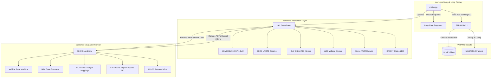

# Custom-Mcu


Chesapeake is a high-performance, modular embedded flight control firmware designed for the Seeed Studio XIAO RP2350 microcontroller. Built in C++ using PlatformIO with the Earle Philhower Arduino-Pico core, it implements state-of-the-art guidance, navigation, and control algorithms, leveraging Eigen for optimized vector mathematics, custom attitude estimation, and custom Hardware Abstraction Layer (HAL) drivers.

---

## 1. System Architecture



### Parallel Dual-Core Execution
Chesapeake is architected to leverage the dual-core capability of the RP2350 microcontroller, achieving high loop speeds and complete thread safety:
*   **Core Concurrency**: 
    *   **Core 0 (HAL & System)**: Handles USB CDC serial communications, CLI commands, battery ADC reads, PWM servo mapping, telemetry outputs, and paces the global loop.
    *   **Core 1 (GNC)**: Runs high-rate flight dynamics tasks: vehicle state estimation, Mahony/Madgwick orientation filtering, cascade PID control loops, and motor output allocation.
*   **Zero Race Conditions**: Employs a double-buffered exchange structure (the current `allb_k` and previous `allb_km1` snapshots of the master `ALLb` bus). Core 1 only triggers when Core 0 signals new sensor frames are available, ensuring lock-free execution without semaphores, mutexes, or shared-memory collisions.
*   **Double the Speed**: Splitting the CPU load across both cores reduces the loop bottleneck to the single-core execution time (approx. 0.3 ms), enabling loop rates up to **2 kHz** with ample margin.
*   **Loop Pacing**:
    *   Regulated on Core 0 (default 1000 Hz, configured via `gnc_looprate_hz`).
    *   Supports two regulation modes in `main.cpp` using `#define USE_ALT_LOOP_REGULATION`. When defined, the core busy-waits for GNC to complete before calculating the remaining sleep time. Otherwise, it sleeps concurrently with GNC processing.

---

## 2. Directory Structure

```
Chesapeake/
├── hardware/
│   ├── bluecrab.net       # KiCad board netlist used to map pinouts
│   └── goofc_aio.net      # Alternative hardware board netlist
├── lib/
│   ├── eigen-master/          # Optimized linear algebra library
│   ├── AlfredoCRSF-main/      # ELRS CRSF serial receiver driver
│   ├── LSM6DSV16X-main/       # SPI IMU sensor driver
│   ├── OpenIMUFilter-master/  # Mahony/Madgwick orientation filter
│   └── pico-bidir-dshot-main/ # PIO-driven bidirectional DShot driver
├── src/
│   ├── main.cpp           # Arduino entrypoint setup and loop pacing
│   ├── CFG_APP/           # CLI Coordinator and command processor
│   │   ├── CFG_APP.hpp    # Header file defining CLI parsing and actuator test structures
│   │   ├── CFG_APP.cpp    # CLI commands reader (help, dump, act_test, get, set, etc.)
│   │   └── bus.hpp        # Data structures for CLI state and actuator testing
│   ├── PARAMS/            # Configuration management & Serial CLI
│   │   ├── MASTERc.hpp    # Master configuration structure
│   │   ├── PARAMS.hpp     # Parameter load/save & CLI runner header
│   │   ├── PARAMS.cpp     # CLI parser and get/set commands
│   │   ├── defaults.hpp   # Hardcoded default values header
│   │   └── defaults.cpp   # Base configuration factory settings
│   ├── HAL/               # Hardware Abstraction Layer
│   │   ├── bus.hpp        # HAL sub-buses (IMUb, MOTb, RCRXb, ACTb, HALb)
│   │   ├── cfg.hpp        # Hardware specific config structs (IMUc, MOTc, etc.)
│   │   ├── HAL.hpp        # Master HAL class coordinator
│   │   ├── HAL.cpp        # Sequences sensor reads & motor writes
│   │   ├── IMU/           # LSM6DSV16X IMU SPI driver
│   │   ├── RCRX/          # ELRS CRSF protocol UART receiver
│   │   ├── MOT/           # Bidirectional DShot motor outputs & RPM feedback
│   │   ├── BAT/           # Analog battery voltage sensor
│   │   ├── SER/           # Servo.h angle command mapping
│   │   └── LED/           # Status LED driver
│   └── GNC/               # Guidance, Navigation, and Control
│       ├── bus.hpp        # Inner communication buses (VSMb, NAVb, CTLb, GUIb, GNCb, ALLb)
│       ├── cfg.hpp        # Flight control config structs (GNCc, CTLc, NAVc, etc.)
│       ├── GNC.hpp        # GNC master class coordinator
│       ├── GNC.cpp        # Sequences estimations, PIDs, and mixing
│       ├── NAV/           # Navigation state estimation
│       ├── CTL/           # Attitude rate/angle control loops
│       │   └── PID/       # 3-Axis & single-axis PID controllers
│       ├── GUI/           # Target input stick mapping & RC Expo
│       ├── ALLOC/         # Actuator mixing & state-based LED blinking
│       └── VSM/           # Vehicle State Machine (Disarmed, Rate, Angle)
```

---

## 3. Hardware Interfacing & Default Pinout

The default microcontroller pin configurations are mapped from the `hardware/bluecrab.net` KiCad schematic for the Seeed Studio XIAO RP2350:

| Peripheral | Netlist Label | RP2350 Pin / GPIO | Notes |
|---|---|---|---|
| **Battery ADC** | `vbat_div` | GPIO26 (A0 / D0) | Voltage divider resistors: $R_1=9.1\text{k}\Omega$, $R_3=1.0\text{k}\Omega$ ($10.1\times$ division factor) |
| **Motor 1** | `M1` | GPIO27 (A1 / D1) | Bidirectional DShot (driven by `DShotX4` instance 1) |
| **Motor 2** | `M2` | GPIO28 (A2 / D2) | Bidirectional DShot (driven by `DShotX4` instance 1) |
| **Motor 3** | `M3` | GPIO5 (D3) | Bidirectional DShot (driven by `DShotX4` instance 2) |
| **Motor 4** | `M4` | GPIO6 (D4) | Bidirectional DShot (driven by `DShotX4` instance 2) |
| **Servo 1** | `SS1_Pin1` | GPIO7 (D5) | PWM Output (Servo class) |
| **Servo 2** | `SS1_Pin2` | GPIO2 (D8) | PWM Output (Shared SPI0 SCK) |
| **Servo 3** | `SS1_Pin3` | GPIO4 (D9) | PWM Output (Shared SPI0 MISO) |
| **Servo 4** | `SS1_Pin4` | GPIO3 (D10) | PWM Output (Shared SPI0 MOSI) |
| **ELRS RX** | `ELRS1_RX` | GPIO0 (TX0) | UART0 interface (`Serial1`) |
| **ELRS TX** | `ELRS1_TX` | GPIO1 (RX0) | UART0 interface (`Serial1`) |
| **IMU CS** | `IMU_CS` | GPIO9 (D18) | SPI1 Chip Select |
| **IMU SCK** | `IMU_SCK` | GPIO10 (D17) | SPI1 Bus Clock |
| **IMU MOSI**| `IMU_MOSI`| GPIO11 (D15) | SPI1 Master-Out Slave-In |
| **IMU MISO**| `IMU_MISO`| GPIO12 (D16) | SPI1 Master-In Slave-Out |
| **Status LED**| `LED_diode`| GPIO17 (D13) | Active High Status indicator |

### "Cursed" IMU Coordinate Alignment
The physical orientation of the LSM6DSV16X SPI IMU sensor on the board requires a hardcoded mapping to align with the standard vehicle body coordinate system (where X is forward, Y is left, and Z is up):
*   **Body X** = IMU Z
*   **Body Y** = IMU Y
*   **Body Z** = IMU X

This is converted during the sensor update sequence in `src/HAL/IMU/IMU.cpp` and rotated via `q_IMU2body` in `src/GNC/NAV/NAV.cpp`.

### Bidirectional DShot Motor Outputs
Motors are controlled using a PIO-driven bidirectional DShot driver (`pico-bidir-dshot-main`).
*   **Driver Layout**: Split across two `DShotX4` instances (one starting at pin M1 driving M1/M2, and one starting at pin M3 driving M3/M4).
*   **PIO Resource Allocation**: Automatically initializes on PIO0, and falls back to PIO1 if an error is detected.
*   **Startup Arming Sequence**: On boot, the flight controller executes a 3-second arming loop sending zero throttle commands (`0`) to initialize and safely arm the external ESCs.

---

## 4. Flight Control & Actuator Mixing

### Quadcopter Actuator Mixer (Quad-X)
The flight controller maps the commanded throttle fraction ($T$), roll effort ($R$), pitch effort ($P$), and yaw effort ($Y$) to the four motors using the following equations:
*   **Motor 1 (Front Left, CW)**: $T - R + P - Y$
*   **Motor 2 (Rear Left, CCW)**: $T - R - P + Y$
*   **Motor 3 (Rear Right, CW)**: $T + R + P + Y$
*   **Motor 4 (Front Right, CCW)**: $T + R - P - Y$

Motors are clamped between the parameterized `min_motor_frac` (default: 0.15) and `max_motor_frac` (default: 1.0) when armed. When disarmed, motors output exactly 0.0.

### Servo Controller
*   Servos 1-4 are driven directly via GNC angle commands (in degrees).
*   Commands map 1:1 to the values written by the HAL module, with no offsets applied in the HAL layer.
*   Angles are clamped to range `[ser_min_ang_deg, ser_max_ang_deg]` (default `[-30.0, 30.0]`) around the central default position (default `90.0`).

### LED Status Pacing
The onboard status LED changes its blink frequency to visually signal the vehicle state:
*   **Disarmed**: Blinks slowly at 1.0 Hz.
*   **Armed (Rate Mode)**: Blinks at 5.0 Hz.
*   **Armed (Angle Mode)**: Blinks rapidly at 10.0 Hz.
*   **Actuator Test Mode**: Blinks at 5.0 Hz.

---

## 5. Packet Telemetry Structure

Telemetry packetization is built on FlatBuffers to achieve high speed and cross-platform compatibility.
*   **Serial Ports**: Dispatched over `Serial` (USB CDC), `Serial1` (UART0), or `Serial2` (UART1) based on configuration.
*   **Decimation**: Telemetry is decamped by a factor of `telemetry_decimation` (default: 10) relative to the primary GNC loop rate to conserve serial bandwidth.
*   **Packet Frame Format**:
    1.  **Sync 1**: `0xAA` (1 byte)
    2.  **Sync 2**: `0xBB` (1 byte)
    3.  **Version**: `0x01` (1 byte)
    4.  **Length LSB**: `fb_len & 0xFF` (1 byte)
    5.  **Length MSB**: `(fb_len >> 8) & 0xFF` (1 byte)
    6.  **Payload**: Binary FlatBuffer stream containing a table of size `fb_len` that wraps a raw array of the `ALLb` bus structure.

---

## 6. Parameter Management & CLI Commands

Chesapeake includes an interactive Serial Command Line Interface (CLI) operating at 115200 baud. Parameters can be modified in RAM and committed to the RP2350 LittleFS filesystem.
*   **LittleFS Persistence**: Parameters are committed to a text file `/config_v2.txt` stored in a 256 KB LittleFS filesystem partition.

The following commands are available:
*   `help` - Show options.
*   `dump` - Print all current RAM parameter settings and values.
*   `get <param>` - Fetch the current value of a specific parameter.
*   `set <param> = <value>` - Adjust a parameter value in RAM (ensure no spaces around the `=` sign).
*   `defaults` - Load default factory parameters into RAM.
*   `save` - Commit RAM parameters to `/config_v2.txt` on LittleFS and reboot the flight controller.
*   `calibrate` - Request IMU bias calibration (keep the board flat and still).
*   `reboot` - Perform a system reboot (`rp2040.reboot()`).
*   `act_test <enabled> <m1> <m2> <m3> <m4> <s1> <s2> <s3> <s4> <led>` - Interactive command to override motor fractions (0.0 to 1.0), servo positions (degrees), and LED blinks for bench testing actuators.

### Factory Parameter Defaults:
*   `gnc_looprate_hz` - Primary controller rate: **1000 Hz** (default).
*   `angle_loop_hz` - Cascade attitude PID loop execution rate: **500 Hz** (default).
*   `led_pin` - Blink indicator pin: **17** (default).
*   `blink_hz_disarmed` / `blink_hz_rate` / `blink_hz_angle` - LED blinking rates: **1.0 Hz** / **5.0 Hz** / **10.0 Hz**.
*   `roll_rate_kp` / `roll_rate_ki` / `roll_rate_kd` - Roll Rate controller terms (default: `0.1`, `0.0`, `0.0`).
*   `roll_ang_kp` - Roll Cascade angle gain (default: `0.1`).
*   `mot_m1_pin` to `mot_m4_pin` - Motor GPIO mappings (default: `27`, `28`, `5`, `6`).
*   `servo_s1_pin` to `servo_s4_pin` - Servo GPIO mappings (default: `7`, `2`, `4`, `3`).
*   `servo_min_us` / `servo_max_us` - Pulse-width limits for servos (default: `1000 us`, `2000 us`).
*   `bat_division_factor` - Calibration scaler for ADC battery readings: **10.1** (default).
*   `imu_cs_pin` - SPI CS pin: **9** (default).
*   `imu_accel_fs` / `imu_gyro_fs` - IMU Full Scale: **8G** / **1000DPS** (default).
*   `imu_accel_odr` / `imu_gyro_odr` - IMU Output Data Rate: **480Hz** / **480Hz** (default).

---

## 7. Web Configurator

Chesapeake includes a browser-based Web Serial GUI configurator located in the `/configurator` directory. It provides a visual dashboard to interact with the flight controller without requiring external CLI tools.

### Features:
*   **Web Serial Interface**: Connects directly to the flight controller over USB Serial (compatible with Chrome, Edge, or Opera).
*   **Interactive Parameter Grid**: Search, read, edit, and write flight parameters in real-time.
*   **Live CLI Terminal**: Built-in monitor and command console.
*   **Quick Controls**: One-click actions to Reboot, Reset Defaults, or trigger IMU Calibration.

### How to Use:
1. Open [configurator/index.html](file:///C:/Users/dashs/OneDrive/Documents/PlatformIO/Projects/Chesapeake/configurator/index.html) in a compatible browser.
2. Click **Connect** and select the flight controller's USB COM port.
3. Once connected, parameters will auto-populate in the grid. Make changes and click **Save Changes** to commit them to LittleFS.

---

## 8. Third-Party Libraries

Chesapeake relies on the following standard open-source libraries:
*   **[Eigen](https://libeigen.gitlab.io/)** (v3.4.99): High-performance matrix and vector math.
*   **[AlfredoCRSF](https://github.com/AlfredoSystems/AlfredoCRSF)** (v1.0.1): ELRS pilot control receiver mapping over CRSF protocol.
*   **[LSM6DSV16X](https://github.com/stm32duino/LSM6DSV16X)** (v2.0.3): STMicroelectronics LSM6DSV16X 6-axis SPI IMU driver.
*   **[pico-bidir-dshot](https://github.com/bastian2001/pico-bidir-dshot)** (v1.0.2): PIO-driven bidirectional DShot throttle signal and RPM telemetry return.
*   **[Servo(rp2040)](https://github.com/earlephilhower/arduino-pico)** (v1.0.0): Hardware PWM servo command generation.
*   **[OpenIMUFilter](https://github.com/hustcalm/OpenIMUFilter)**: Highly optimized Mahony/Madgwick orientation filter.

---
Assisted by Gemini.
